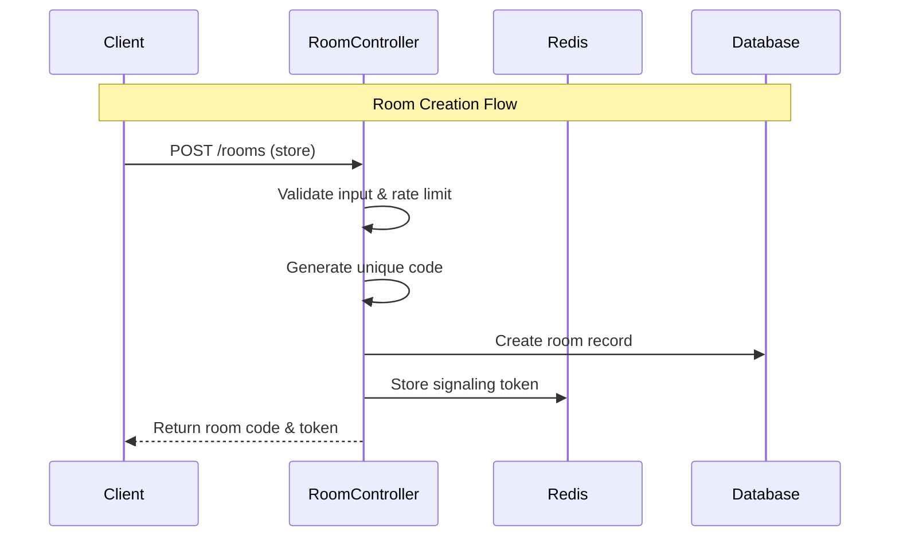
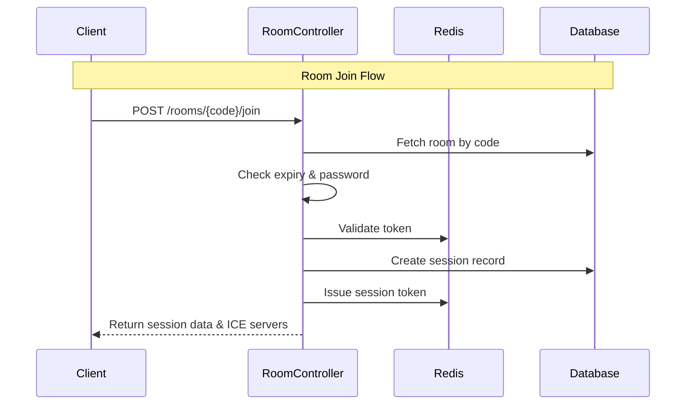
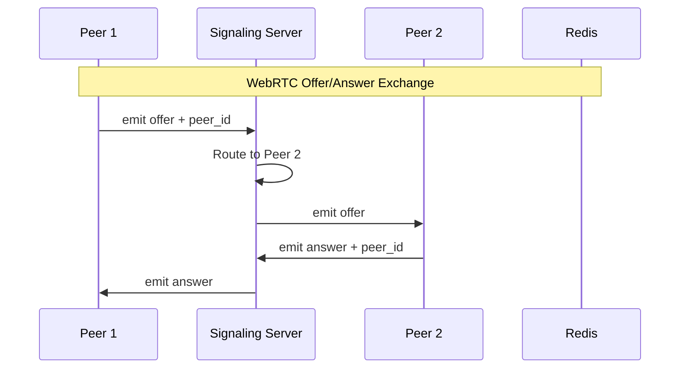
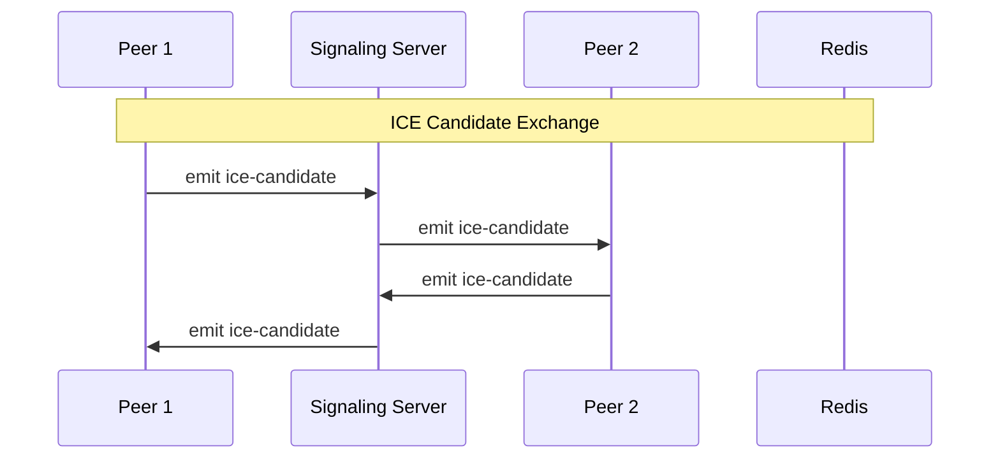
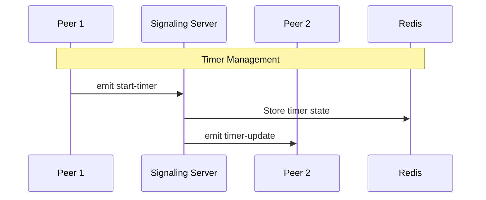

# FlowSync Architecture Flows

This document provides detailed sequence diagrams illustrating the key interaction flows in the FlowSync application. These diagrams show how different components communicate during critical operations.

## Table of Contents
1. [Room Management Flows](#room-management-flows)
   - [Room Creation Flow](#room-creation-flow)
   - [Room Join Flow](#room-join-flow)
2. [WebRTC Signaling Flows](#webrtc-signaling-flows)
   - [Offer/Answer Exchange](#offeranswer-exchange)
   - [ICE Candidate Exchange](#ice-candidate-exchange)
   - [Timer Management](#timer-management)

## Room Management Flows

### Room Creation Flow

This flow shows how a client creates a new room through the Laravel backend API. The backend generates a unique room code, stores the room in the database, and creates a signaling token in Redis for WebRTC connection authentication.

**Key Steps:**
1. Client sends a POST request to create a new room
2. RoomController validates the input and applies rate limiting by IP address
3. A unique 6-character room code is generated
4. Room details are persisted to the MySQL database
5. A signaling token is stored in Redis with a TTL (Time To Live)
6. Client receives the room code and token for joining

### Room Join Flow

This flow demonstrates how a client joins an existing room. The system validates the room code, checks for expiry and password requirements, validates the token, and creates a session record.

**Key Steps:**
1. Client requests to join a room using the room code
2. RoomController fetches the room details from the database
3. The system checks if the room has expired and validates the password (if required)
4. Token is validated against Redis
5. A session record is created in the database for analytics
6. A new session token is issued and stored in Redis
7. Client receives session data including ICE server configuration for WebRTC

## WebRTC Signaling Flows

### Offer/Answer Exchange

This flow illustrates the WebRTC peer-to-peer connection establishment using the signaling server. The signaling server acts as a relay to exchange SDP (Session Description Protocol) offers and answers between peers.

**Key Steps:**
1. Peer 1 creates a WebRTC offer and sends it to the signaling server with the target peer ID
2. Signaling server routes the offer to Peer 2
3. Peer 2 receives the offer and generates an answer
4. The answer is sent back through the signaling server
5. Peer 1 receives the answer, completing the SDP exchange
6. After this exchange, peers can establish a direct P2P connection

### ICE Candidate Exchange

ICE (Interactive Connectivity Establishment) candidates are exchanged to help peers discover the best network path for their connection, including handling NAT traversal.

**Key Steps:**
1. As each peer discovers ICE candidates (potential network paths), they send them to the signaling server
2. The signaling server relays these candidates to the other peer
3. This exchange happens bidirectionally throughout the connection process
4. Peers use these candidates to find the optimal connection path (direct P2P if possible, or via TURN server if needed)

### Timer Management

The synchronized Pomodoro timer is managed through the signaling server with state persistence in Redis to ensure all participants see the same timer state.

**Key Steps:**
1. Room creator (Peer 1) initiates a timer action (start/pause/reset)
2. Signaling server receives the timer event
3. Timer state is persisted to Redis for durability and state recovery
4. The signaling server broadcasts the timer update to all participants in the room
5. All peers receive the synchronized timer state

## Component Responsibilities

### Laravel Backend (RoomController)
- **Room Management**: Create, validate, and manage room lifecycle
- **Authentication**: Generate and validate tokens
- **Persistence**: Store rooms, messages, and session data
- **Rate Limiting**: Prevent abuse through IP-based rate limiting
- **ICE Configuration**: Provide TURN/STUN server credentials

### Node.js Signaling Server
- **WebRTC Signaling**: Relay offers, answers, and ICE candidates
- **Real-time Communication**: Manage Socket.IO connections
- **Presence Management**: Track active participants per room
- **Timer Synchronization**: Coordinate synchronized timers across clients
- **State Broadcasting**: Relay state changes to all room participants

### Redis
- **Token Storage**: Store and validate signaling and session tokens
- **Timer State**: Persist timer state for recovery and synchronization
- **Session Data**: Cache active session information
- **Participant Tracking**: Maintain lists of active participants per room

### MySQL Database
- **Persistent Storage**: Store rooms, messages, and session history
- **Analytics**: Track room usage and session data
- **Audit Trail**: Maintain history for troubleshooting

## Security Considerations

1. **Token Validation**: All WebRTC signaling requires valid tokens issued by the Laravel backend
2. **Rate Limiting**: Room creation is rate-limited by IP address to prevent abuse
3. **Room Expiry**: Rooms automatically expire after 24 hours of inactivity
4. **Password Protection**: Optional password protection for sensitive rooms
5. **Creator Privileges**: Only room creators can control timers and kick participants

## Error Handling

- **Invalid Tokens**: Clients with invalid tokens are disconnected immediately
- **Room Expiry**: Expired rooms return appropriate error messages
- **Network Failures**: WebRTC includes fallback to TURN servers if direct P2P fails
- **Disconnection**: Graceful handling of participant disconnections with cleanup

## Related Documentation

- [Product Requirements Document](prd.md) - Full product specifications
- [README](../README.md) - Project overview and quick start

---

*These diagrams were generated from the initial MVP implementation and reflect the core architecture of FlowSync.*
